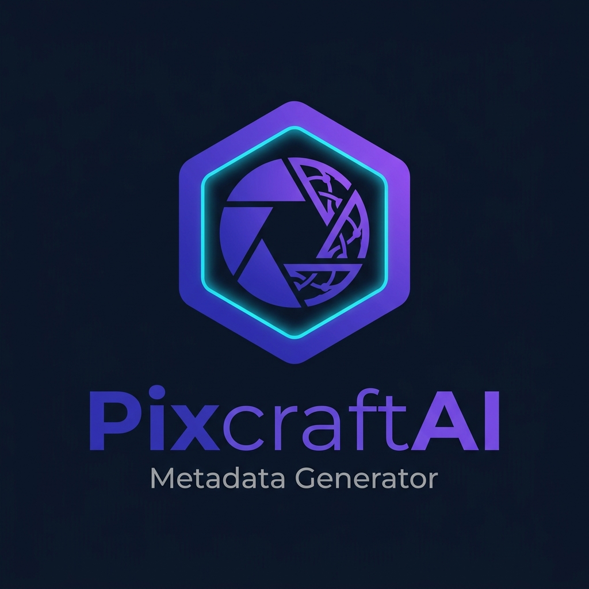

  

# PixCraftAI – Stock Photo SEO Metadata & Keyword Generator

A professional, high-throughput microstock SEO metadata suite inspired by [PixCraftAI](https://www.pixcraftai.com/), built for stock contributors submitting to **Adobe Stock**, **Shutterstock**, **Freepik**, **Vecteezy**, **Depositphotos**, **123RF**, **Dreamstime**, and **Alamy**.

---

## 🌟 PixCraftAI Features & Capabilities

### 1. 🎯 Multi-Platform SEO Engines
- **Adobe Stock Engine**: Prioritizes front-loaded titles (55–75 chars optimal) and curates the **Top 10 keywords (which carry 80% search ranking weight)**.
- **Shutterstock Engine**: Full descriptive sentences (60–90 chars) with lighting style, shot type, and 48 comprehensive commercial tags.
- **Freepik Engine**: Clean graphic designer tags, background color attributes, and utility keywords.
- **Vecteezy Engine**: Specialized vector, banner, template, and copy-space categorizations.
- **Depositphotos, 123RF, Dreamstime & Alamy**: Custom character counts and keyword density rules.

### 2. 🗂️ Category Auto-Detection & Selection
- Compliant with **Adobe Stock's 21 official categories** (Lifestyle, Business, People, Technology, Food, Landscapes, Animals, etc.).
- Dropdown selector for instant manual override per asset or across the entire batch queue.

### 3. 🎨 Asset Medium & Licensing Controls
- Asset classification: **Photography (Live Action)**, **Vector / Illustration**, **3D Render / CGI**, or **Generative AI (Disclosed)**.
- Commercial vs. Editorial licensing intent.
- Model/Property release tracking.

### 4. ⚡ 9 State-of-the-Art AI Models Supported
- **ChatGPT**: OpenAI GPT-4o / GPT-5 natural language comprehension.
- **Gemini**: Google Gemini 2.5 Flash (Recommended - 1,500 req/day High-Quota Vision Engine) & Gemini 2.0 / 3.8 Flash.
- **Claude**: Anthropic Claude 3.7 Sonnet nuanced reasoning & spam elimination.
- **Grok**: xAI Grok 3 real-time stock commercial intelligence.
- **Perplexity**: Perplexity Sonar live web search & trending microstock tags.
- **DeepSeek**: DeepSeek R1 deep chain-of-thought analysis.
- **Llama**: Meta Llama 3.3 microstock taxonomy classification.
- **Qwen**: Alibaba Qwen 2.5 cross-lingual buyer optimization.
- **Mistral**: Mistral Large 2 high-precision European stock indexing.
- **Interactive Conversational AI Chat Copilot**: Real-time chatting with **ChatGPT**, **Gemini**, **Claude**, **Grok**, and all 9 models directly from the main search bar or the floating assistant widget.
- **Bilingual & Context-Aware**: Answers fluently in both English and Bengali (বাংলা), generating high-ranking microstock titles, 48 keywords, Midjourney prompts, and Adobe Stock acceptance tips.
- **Live Gemini API & Dynamic Built-in Engine**: Connect your Google Gemini API key for live multimodal responses or enjoy the zero-config built-in intelligent engine with instant replies.
- **5000 Free Pro Credits**: Default active balance for all Pro models.
- **Fast Built-in Heuristic Mode**: Instant offline generation when no API key is provided, generating compliant titles, descriptions, and 48 ranked tags with zero lag.
- **Built-in API Key Tester & Quota Fallback**: Direct "Test Connection & Verify Quota" button with zero-quota key validation and automatic fallback to Gemini 2.5 Flash if an experimental model hits rate limits.
- **One-Click Header AI Engine Status**: Dedicated AI status pill directly in the top navigation bar and Metadata Generator workspace.

### 5. 🛠️ Complete PixcraftAI Creative Suite Tools
1. **Metadata Generation Suite**: High-throughput microstock tagging and title generator with Top 10 keyword weighting and CSV exports.
2. **Image2Prompt Generator**: Reverse-engineer Midjourney v6.1, Flux.1, and SDXL production prompts from existing images.
3. **AI Image Generation Studio**: Built-in canvas text-to-image generator with style presets, aspect ratio controls, and direct 1-click addition to metadata batch queue.
4. **Commercial Prompt Architect**: Generates 3 high-yield commercial stock prompts optimized for high download volume.
5. **AI Batch Editor**: Comprehensive batch operations: Find & Replace keywords, prefix/suffix titles, bulk tag injection, and category/medium setters.
6. **2026 Microstock Event Calendar**: 12-month seasonal opportunities with 90-day early submission guidelines and 1-click project initialization.
7. **AI Rejection Predictor**: Pre-screens assets for trademark/IP infringement, spam buzzwords, title front-loading, and technical sharpness.
8. **Bulk Image Upscaler**: 2x, 4x, 8x Super-Resolution studio with clarity enhancement, noise reduction, and high-res PNG export.
9. **Bulk BG Remover**: Alpha matte background isolator for transparent PNGs and pure white stock cutouts.
10. **Microstock Market Intelligence**: Live agency commission breakdowns (Adobe Stock, Shutterstock, Freepik, Vecteezy) and keyword commercial demand estimator.

### 6. 📱 All-Device Responsive Design
- **Mobile First & Fully Adaptive**: Tested and optimized for mobile screens (320px–480px), tablets (640px–1024px), and ultra-wide desktops.
- **Touch-Friendly Controls**: Minimum 44px touch targets, non-overflowing flex containers, horizontal smooth carousels, and responsive modal viewports.
- **Universal Modal Architecture**: Scrollable dialogs with backdrop click dismissal and Escape key handlers.

### 8. 📦 Multi-Agency Ready CSV Exports (UTF-8 Unicode Protected)
- **UTF-8 Byte Order Mark (`\uFEFF`)**: Injected into every CSV export so Microsoft Excel on Windows/Mac and LibreOffice open the file in pure UTF-8 without garbled text (`’`, `—`, etc.) or character corruption.
- **RFC 4180 Compliant Sanitization**: All fields automatically stripped of internal line breaks (`\r\n`), tabs, and control characters to prevent broken rows and column shifting.
- **Microstock Agency Title Rules**: Double quotes inside titles are automatically converted to clean single quotes (`'`) and trailing punctuation (periods, commas) is stripped to ensure 100% acceptance by Adobe Stock and Shutterstock automated parsers.
- **Adobe Stock CSV**: `Filename,Title,Keywords,Category,Releases`
- **Shutterstock CSV**: `Filename,Description,Keywords,Categories`
- **Freepik CSV**: `Filename,Title,Keywords`
- **Vecteezy CSV**: `Filename,Title,Description,Keywords`
- **Universal Microstock CSV**: All 7 master fields.
- **Dedicated Agency Export Modal**: 1-click downloads for any agency format with column format badges.
- **Clipboard One-Click Copy**: Copy current row or entire batch CSV table.
- **ZIP Project Bundle**: Download standalone package with clean `index.html` and UTF-8 CSV.

### 9. 🌓 PixCraftAI Dark & Light Themes
- Sleek dark theme by default (`#080c14` with glassmorphism and neon accents).
- Single-click Sun/Moon toggle for light mode.

### 10. 🎙️ Two-Way Real-Time Voice Conversation (Live Voice Mode)
- **ChatGPT & Gemini-style Voice Session**: Talk directly with any AI model using your microphone in English or বাংলা (Bengali).
- **Web Speech STT (Speech-to-Text)**: Live real-time speech transcription with animated 7-bar audio frequency visualizer and pulsing orb.
- **Dynamic Language Switcher**: Single click toggle between **বাংলা (BN - `bn-BD`)** and **English (EN - `en-US`)**.
- **Auto-Silence & Send**: Speaks, detects silence pause, automatically sends query to model, and retrieves insights.
- **SpeechSynthesis TTS (Text-to-Speech)**: The model speaks back aloud automatically! Includes **🔊 Read Aloud** and **⏹ Stop Speaking** buttons on every chat response bubble.

### 11. 🔐 User Password & Admin Access Control System
- **Mandatory Login Gatekeeper**: No user can access or view workspace contents without authorized Gmail & Password credentials.
- **Master Admin Ownership**: Complete administrative authority held by the owner (**Rafiqul Islam**).
  - **Default Master Admin**: `rafiqulislam11@gmail.com`
  - **Default Password**: `Admin@2026#Pix`
- **Contributor Request Access Workflow**: Visitors can submit an access request with their Name, Gmail, desired password, and portfolio note. Accounts remain in `Pending` state until approved by Admin.
- **1-Click Admin Access Control**:
  - **Revoke / Block Access**: Instantly suspends any user. If that user is currently active, they are kicked out within 3.5 seconds!
  - **Permanent Delete User**: Completely removes user records from the system.
  - **Change / Reset Password**: Admin can reset any user's password directly.
  - **Direct User Creation**: Add authorized contributors and copy ready-to-send credentials for WhatsApp or Email.
  - **Offline Cryptographic Passkeys**: Generates HMAC-signed passcodes for static GitHub Pages hosting.
  - **Global Cloud Sync (Firebase)**: 1-click connection to sync accounts, approvals, and revocations in real-time across all devices.

---

## 🚀 Quick Start

1. Double-click [index.html](file:///c:/Users/RAFIQULISLAM/Desktop/All%20Apps/10-%20APPS%20GENERATE/40-Metadata-Create/index.html) to open in your browser.
2. Sign in with your Gmail and password (or use the Master Admin auto-fill).
3. Open **Admin Access** in the top header to manage users, approve access requests, or revoke contributors.
4. Drag & drop images into the upload drop zone and generate high-ranking stock metadata!

---

## 📄 License

MIT License. Free for all stock contributors and creative workflows.
